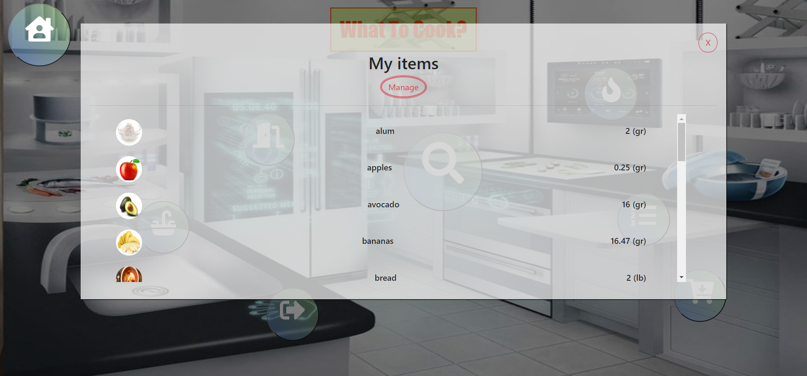
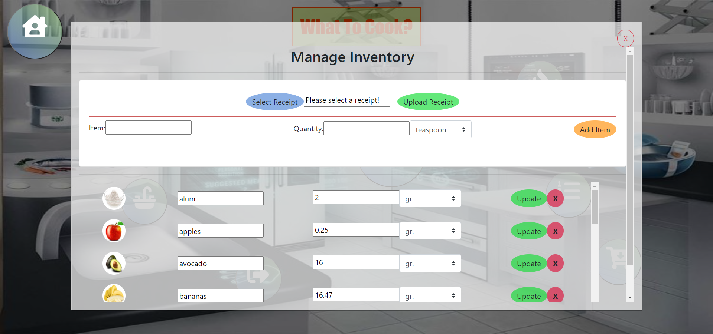
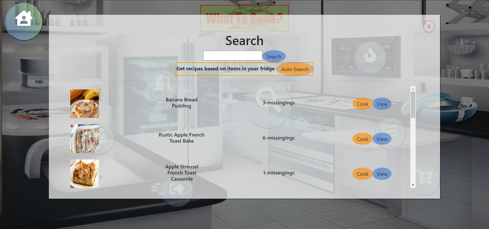
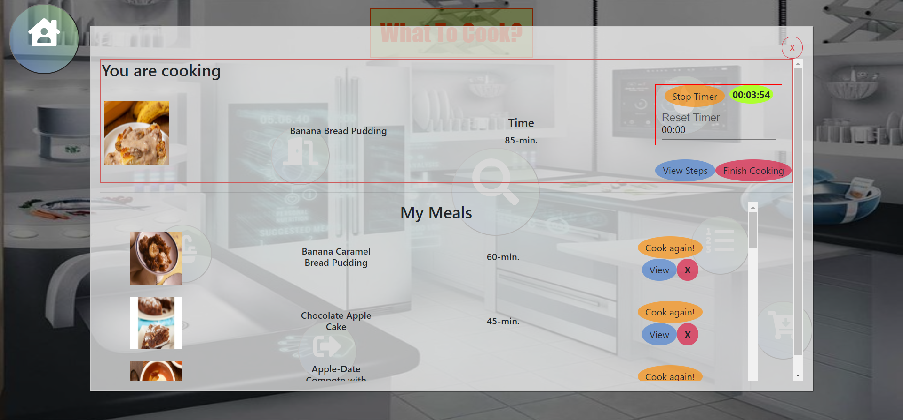
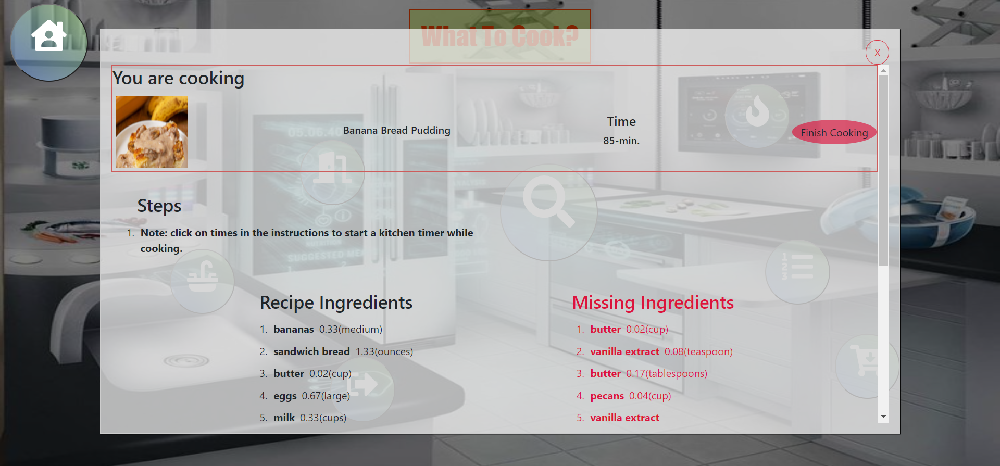
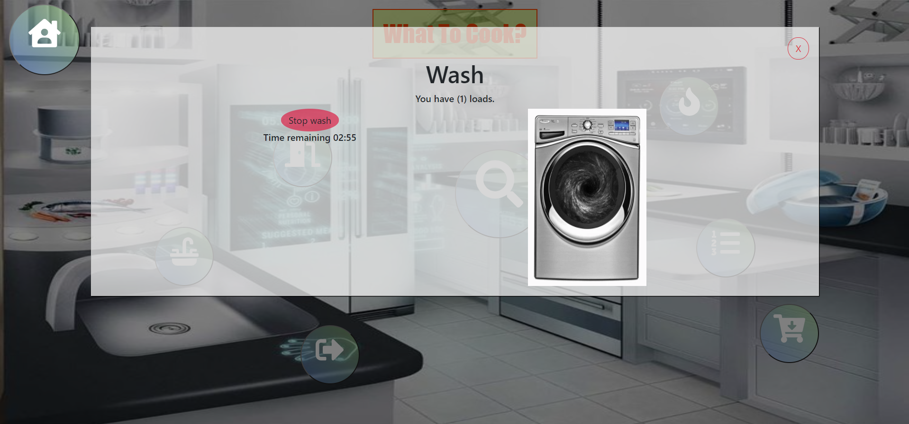

# What-To-Cook

Overview:
What-To-Cook is a Website designed to make meal planning efficient, easy and waste free. Users can view recipes that they can make based on foods that they already have in their fridge. 

## Getting Started
These instructions will get you a copy of the project up and running on your local machine for development and testing purposes.

### Installing
Git clone the repository to your local machine:

HTTPS:
```
https://github.com/AmjedAyoub/What-To-Cook.git
```
SSH:
```
git@github.com:AmjedAyoub/What-To-Cook.git
```

Open the cloned repository in your visual studio.

You will then be able to start the app locally by running:

```
npm install
```

```
npm start
```

# Technologies Used:
 * APIs:
    * Spoonacular 
    * Taggun
    
* Programming Language:
    * JavaScript
    * React
    * NodeJS

# Instructions:
What-To-Cook is mobile friendly and easy to use! It does require user authentication, so users will need to make an account when they first enter the site. 

* 1)Users enter the homepage and can either login or create an account.
Login


* 2)Once they are logged into What-To-Cook they are directed to Home page


* 3)View/Update inventory will lead them to a page where they can scan or upload their grocery receipt or manually upload items. The receipt scan feature will scan any grocery receipt and pull only the food items. 



* 4)The Search page allows users to get a recipe based on key ingredients or simply view recipes based on ingredients that they have in their inventory. 


* 5) There is also the option to view saved recipes. Users can click this what is cooking button and view recipes that they have previously saved. They can view or delete these recipes. 



* 6) Finally users can do their wash loads.


## Links
This program is deployed on [Heroku](http://whatcook.herokuapp.com/).\
This program is published on [GitHub](https://github.com/AmjedAyoub/What-To-Cook).

## Authors
See contribution history [here](https://github.com/AmjedAyoub/What-To-Cook/graphs/contributors).
